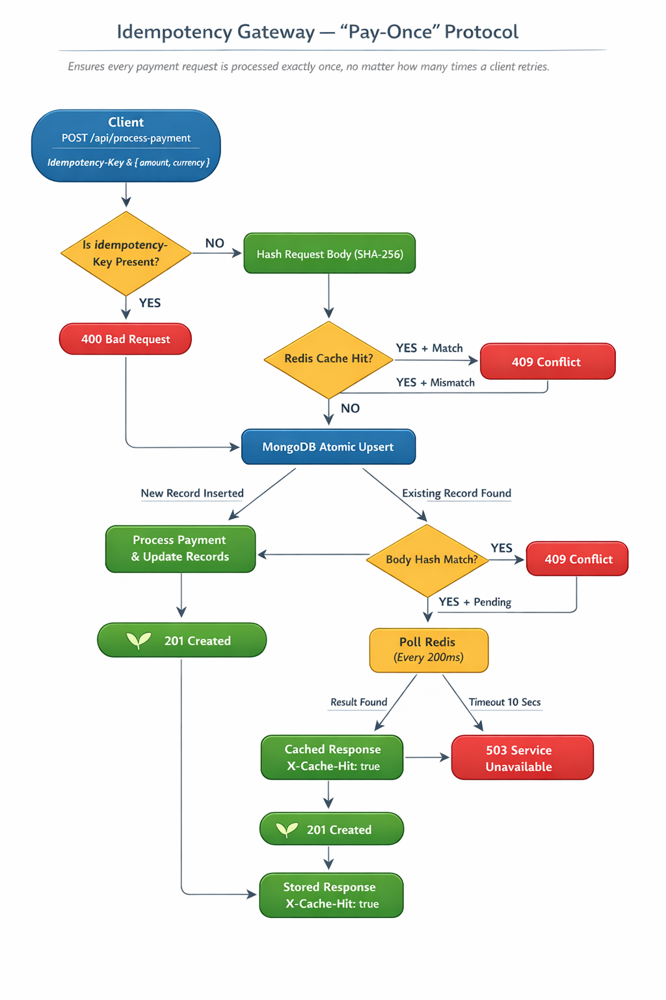
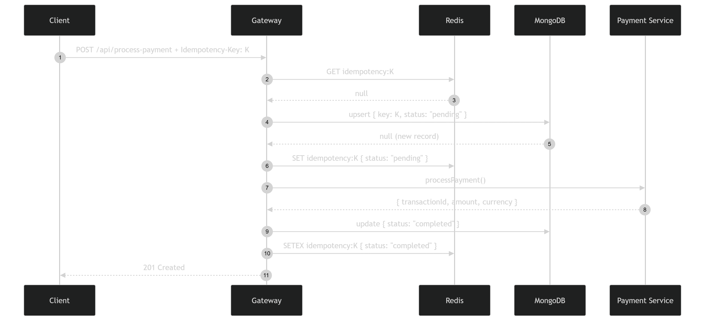

# Idempotency Gateway — The "Pay-Once" Protocol

A production-grade idempotency layer that guarantees every payment is processed **exactly once** — no matter how many times a client retries.


---

## Table of Contents

1. [Overview](#overview)
2. [Architecture](#architecture)
3. [Project Flow Chart](#project-flow-chart)
4. [Sequence Diagrams](#sequence-diagrams)
5. [Setup Instructions](#setup-instructions)
6. [Interactive API Documentation](#interactive-api-documentation)
7. [API Reference](#api-reference)
8. [Design Decisions](#design-decisions)
9. [Developer's Choice — Key Expiry (TTL)](#developers-choice--key-expiry-ttl)
10. [Running Tests](#running-tests)
11. [Project Structure](#project-structure)

---

## Overview

FinSafe Transactions Ltd. faced a critical problem: network timeouts caused e-commerce clients to retry payment requests, resulting in **double charges**. This gateway solves that by introducing an idempotency layer between the client and the payment processor.

| Scenario | Behavior |
| :--- | :--- |
| First request with a unique key | Payment is processed and the response is stored |
| Retry with the **same key + same body** | Stored response is returned instantly — no re-processing |
| Retry with the **same key + different body** | `409 Conflict` — fraud and error guard |
| Two identical requests arriving **simultaneously** | Only one is processed; the other waits and receives the same result |

---

## Architecture

The gateway uses a **two-tier caching strategy** to balance speed and durability.

```text
┌──────────────────────────────────────────────────────────────────┐
│                          CLIENT                                  │
│            POST /api/process-payment                             │
│            Idempotency-Key: <uuid>                               │
└──────────────────────┬───────────────────────────────────────────┘
                       │
                       ▼
┌──────────────────────────────────────────────────────────────────┐
│                   IDEMPOTENCY MIDDLEWARE                         │
│                                                                  │
│   L1 ──► Redis       Sub-ms cache hit + distributed lock        │
│   L2 ──► MongoDB     Persistent store + atomic upsert fallback  │
└──────────────────────┬───────────────────────────────────────────┘
                       │  (new request only)
                       ▼
┌──────────────────────────────────────────────────────────────────┐
│                   PAYMENT HANDLER                                │
│   • Validate amount & currency                                   │
│   • Simulate 2-second processing                                 │
│   • Return 201 { message, transactionId, ... }                   │
└──────────────────────────────────────────────────────────────────┘
```

| Layer | Technology | Responsibility |
| :--- | :--- | :--- |
| L1 — Cache | **Redis** | Sub-millisecond fast-path for completed responses; poll-based in-flight deduplication |
| L2 — Store | **MongoDB** | Persistent source of truth; atomic `findOneAndUpdate` upsert with unique index prevents DB-level race conditions |

---

## Project Flow Chart



---

## Sequence Diagrams



---

## Setup Instructions

### Prerequisites

| Dependency | Minimum Version |
| :--- | :---: |
| Node.js | 18 |
| MongoDB | 6 |
| Redis | 6 |

### Step 1 — Clone and install

```bash
git clone https://github.com/<your-username>/idempotency-gateway.git
cd idempotency-gateway
npm install
```

### Step 2 — Configure environment

```bash
cp .env.example .env
```

Edit `.env` with your values:

```ini
PORT=3000
MONGODB_URI=mongodb://localhost:27017/idempotency_gateway
REDIS_URL=redis://localhost:6379
IDEMPOTENCY_KEY_TTL_HOURS=24
IN_FLIGHT_POLL_INTERVAL_MS=200
IN_FLIGHT_TIMEOUT_MS=10000
```

| Variable | Default | Description |
| :--- | :---: | :--- |
| `PORT` | `3000` | HTTP port the server listens on |
| `MONGODB_URI` | `localhost:27017` | MongoDB connection string |
| `REDIS_URL` | `localhost:6379` | Redis connection string |
| `IDEMPOTENCY_KEY_TTL_HOURS` | `24` | Hours before a key expires and may be reused |
| `IN_FLIGHT_POLL_INTERVAL_MS` | `200` | Polling cadence while waiting for an in-flight request |
| `IN_FLIGHT_TIMEOUT_MS` | `10000` | Max wait time before returning 503 |

### Step 3 — Build and run

```bash
# Start in development (ts-node)
npm run dev

# OR build and start in production
npm run build && npm start
```

Server is ready at `http://localhost:3000`.

Swagger UI is available at `http://localhost:3000/api-docs`.

---

## Interactive API Documentation

Once the server is running, visit **[http://localhost:3000/api-docs](http://localhost:3000/api-docs)** to access the interactive Swagger UI.

You can:
- Explore all endpoints with full request/response schemas
- Try out API calls directly from the browser
- See example payloads for success and error cases
- Test idempotency behavior by sending duplicate requests

---

## API Reference

### POST /api/process-payment

Processes a payment. Safe to retry with the same `Idempotency-Key`.

#### Required Header

| Header | Description |
| :--- | :--- |
| `Idempotency-Key` | Unique identifier for this operation (UUID recommended) |

#### Request Body

```json
{
  "amount": 100,
  "currency": "GHS"
}
```

| Field | Type | Required | Constraints |
| :--- | :---: | :---: | :--- |
| `amount` | `number` | Yes | Positive numeric value |
| `currency` | `string` | Yes | One of `GHS` `USD` `EUR` `GBP` `NGN` |

#### Response — 201 Created (first request)

```json
{
  "status": "success",
  "message": "Charged 100 GHS",
  "transactionId": "TXN-1719000000000-AB12CD",
  "amount": 100,
  "currency": "GHS",
  "processedAt": "2025-01-01T12:00:02.000Z"
}
```

#### Response — 201 Created (duplicate / cached replay)

Same body as above, with an additional response header:

```text
X-Cache-Hit: true
```

#### Response — 400 Bad Request (missing header or invalid body)

```json
{ "error": "Missing required header: Idempotency-Key" }
```

```json
{ "error": "amount must be a positive number" }
```

#### Response — 409 Conflict (same key, different body)

```json
{ "error": "Idempotency key already used for a different request body." }
```

#### Response — 503 Service Unavailable (in-flight timeout)

```json
{ "error": "A request with this key is already being processed. Please retry shortly." }
```

---

### GET /health

Returns server health status. No authentication required.

```json
{ "status": "ok" }
```

---

## Design Decisions

### Two-Tier Cache — Redis then MongoDB

Every request checks **Redis first**. A completed response cached in Redis is returned in under a millisecond without touching MongoDB. Redis serves as the fast-path cache and the polling target for in-flight requests.

**MongoDB** is the persistent fallback. Its `findOneAndUpdate` with `upsert: true` and `$setOnInsert` atomically creates or retrieves a record in a single round-trip. This keeps the system correct even if Redis is unavailable or if the key was evicted.

### Atomic Upsert — Race Condition Safety

Two simultaneous requests both attempt a MongoDB upsert. MongoDB's unique index on `key` ensures only one document is created. The losing request catches `E11000` (duplicate-key error) and falls into the wait path rather than spawning a second payment — zero double-processing guaranteed at the database level.

### In-Flight Polling

While the first request is processing, duplicate arrivals poll Redis every `IN_FLIGHT_POLL_INTERVAL_MS` until the result appears or the timeout is reached. Polling was chosen over WebSockets or Server-Sent Events to keep the gateway **stateless** — any horizontal replica can answer a retry because all shared state lives in Redis and MongoDB.

### Body Hashing — SHA-256

The request body is hashed with SHA-256 before storage. This keeps records small, makes body comparison `O(1)` regardless of payload size, and reliably detects any tampered field.

### Strict TypeScript

All source files are written in TypeScript with `strict: true`. Request and response shapes are enforced via interfaces, Mongoose documents carry typed generics, and Express middleware signatures are correctly typed — contract violations are caught at compile time, not in production.

---

## Developer's Choice — Key Expiry (TTL)

Every idempotency record carries an `expiresAt` timestamp. MongoDB's **TTL index** auto-deletes documents once this timestamp passes, and Redis keys are written with an expiry using the same window — both layers self-prune without any manual cleanup job.

| Concern | Without TTL | With TTL |
| :--- | :--- | :--- |
| Storage growth | Records accumulate forever | Auto-pruned; bounded and predictable |
| Regulatory compliance | Indefinite storage may violate data-retention policies | Configurable retention window matches policy |
| Key reuse | A key is blocked forever after a single use | After 24 h the same key can be safely reused |
| Operational overhead | Manual cleanup jobs required | Zero maintenance |

The 24-hour default aligns with the idempotency windows used by **Stripe**, **Paystack**, **Visa**, and **Mastercard**. It can be adjusted per deployment via `IDEMPOTENCY_KEY_TTL_HOURS` with no code changes.

---

## Running Tests

```bash
npm test
```

Tests use a dedicated `idempotency_gateway_test` database (dropped after each run) and flush Redis before each case to guarantee isolation.

| Suite | Coverage |
| :--- | :--- |
| **User Story 1** | `201` on first request; `400` for missing key, negative amount, unsupported currency |
| **User Story 2** | Identical body on retry returns cached response with `X-Cache-Hit: true` and no 2-second delay |
| **User Story 3** | `409` when the same key is reused with a different body |
| **Bonus** | Two concurrent requests return identical results; only one payment is processed |

---

## Project Structure

```text
idempotency-gateway/
│
├── src/
│   ├── app.ts                       # Express app & server bootstrap
│   ├── types/
│   │   └── index.ts                 # Shared TypeScript interfaces
│   ├── config/
│   │   ├── database.ts              # MongoDB connection (Mongoose)
│   │   ├── redis.ts                 # Redis connection (ioredis)
│   │   └── swagger.ts               # Swagger/OpenAPI specification
│   ├── middleware/
│   │   └── idempotency.ts           # Core idempotency logic — Redis + MongoDB
│   ├── models/
│   │   └── IdempotencyRecord.ts     # Mongoose schema + TTL index
│   ├── routes/
│   │   └── payment.ts               # POST /api/process-payment
│   └── services/
│       └── paymentService.ts        # Validation + simulated payment processing
│
├── tests/
│   └── payment.test.ts              # Jest + Supertest integration tests
│
├── assets/
│   ├── AmaliTech_Challenge_flowChat.png   # Flowchart diagram
│   └── Amalitech_squence_diagram.png      # Sequence diagrams
│
├── .env.example                     # Environment variable template
├── .gitignore
├── tsconfig.json                    # TypeScript compiler configuration (src only)
├── tsconfig.test.json               # TypeScript configuration for Jest
├── package.json
└── README.md
```
